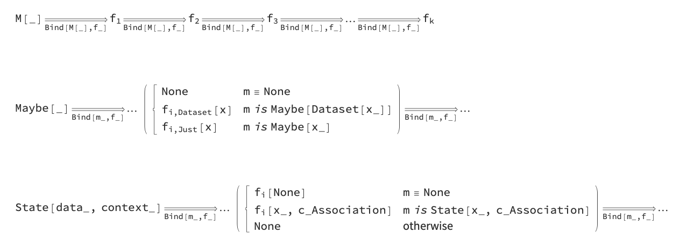
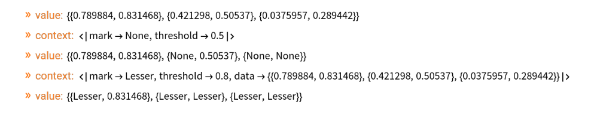

# MonadMakers WL paclet

Wolfram Language (aka Mathematica) paclet for making software monads.

Monad programming provides an interface design method that allows interactive, 
dynamic creation and change of sequentially structured computations with polymorphic and context-aware behavior.

- In this paclet the concept "software monad" is seen as a design pattern, suitable for building rapid, dynamic computation workflows building.
- WL code of software monads can be generated (and evaluated) with `GenerateStateMonadCode`.
- The monadic pipelines can be constructed with the douple right arrow symbol, "⟹".
- The generated monads have context that is an Association. accessible with functions with the suffixes "EchoContext" and "EchoFunctionContext".
- Each generated monad has a "pipeline value" accessible with functions with the suffixes "EchoValue" and "EchoFunctionValue".
- The "monad tracer", `TraceMonad`, allows tracking of pipeline executions with other monads.
- The generated monads adhere to the monad axioms.
- We do not deal with types for monads explicitly, we generate code for monads instead.
- One reason for this is that in WL the notion of algebraic data type is not needed -- pattern matching can be used instead. (And pattern matching comes from WL's core "book of replacement rules" principle.)

Here are corresponding formulas:



Here is example code

```mathematica
SeedRandom[34];
MStateUnit[
   RandomReal[{0, 1}, {3, 2}], <|"mark" -> "None", "threshold" -> 0.5|>] ⟹
       MStateEchoValue ⟹
       MStateEchoContext ⟹
       MStateAddToContext["data"] ⟹
       (MStateUnit[#1 /. (x_ /; x < #2["threshold"] :> #2["mark"]), #2] &) ⟹
       MStateEchoValue ⟹
       MStateModifyContext[Join[#1, <|"mark" -> "Lesser", "threshold" -> 0.8|>] &] ⟹
       MStateEchoContext ⟹
       (MStateUnit[#2["data"] /. (x_ /; x < #2["threshold"] :> #2["mark"]), #2] &) ⟹
       MStateEchoValue;
```



------

## References

### Articles

[AA1] Anton Antonov, 
[Monad code generation and extension](https://mathematicaforprediction.wordpress.com/2017/06/23/monad-code-generation-and-extension/),
(2017),
[MathematicaForPrediction at WordPress](https://mathematicaforprediction.wordpress.com/).

[AA2] Anton Antonov,
[Object-Oriented Design Patterns in Mathematica](),
(2016),
[MathematicaForPrediction at WordPress](https://mathematicaforprediction.wordpress.com/).

### Videos

[AAv1] Anton Antonov,
[“Monadic Programming: With Application to Data Analysis, Machine Learning and Language Processing"](https://www.youtube.com/watch?v=_cIFA5GHF58), 
presentation at [Wolfram Technology Conference 2017](https://www.wolfram.com/events/technology-conference/2017/).

